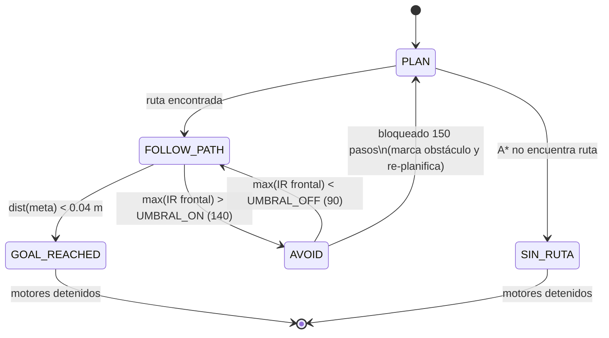
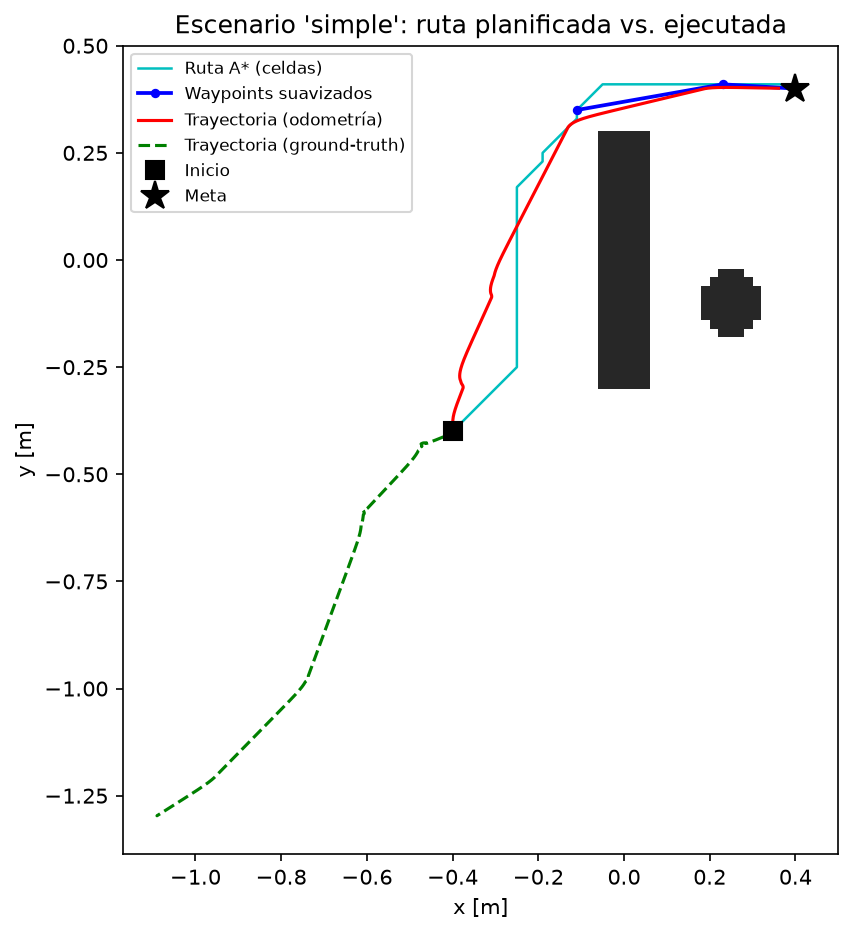

# Navegación Autónoma con Planificación de Rutas (A\*) — e-puck en Webots

**Proyecto Final · ICI 4150 — Robótica y Sistemas Autónomos 2026 · PUCV**

## 1. Integrantes

<!-- COMPLETAR: nombres y correos de los integrantes del grupo -->
- Integrante 1: `ESTEBAN SCHANZCHE — correo@pucv.cl`
- Integrante 2: `EVA PONCE — eva.ponce@pucv.cl`
- Integrante 3: `NICOLÁS FUENTES — nicolas.fuentes@pucv.cl`
- Integrante 4: `JUAN GERALDO — juan.geraldo@pucv.cl`

## 2. Línea seleccionada

**Línea A — Planificación de rutas.** El robot planifica una ruta global con **A\*** sobre una **grilla de ocupación** y la ejecuta con un controlador cinemático diferencial, protegido por una **capa reactiva** basada en los sensores IR.

## 3. Objetivo del proyecto

Diseñar, implementar y evaluar un sistema de navegación autónoma para el e-puck que, partiendo de una pose inicial conocida, (1) construya una representación del entorno como grilla de ocupación, (2) planifique una ruta hacia la meta con A\* y la suavice por línea de visión, (3) convierta la ruta en comandos de movimiento mediante el modelo cinemático diferencial con pose estimada por odometría, (4) use los sensores de proximidad para evitar colisiones, detenerse ante riesgo y re-planificar si queda bloqueado, y (5) registre y analice su comportamiento comparando la ruta planificada con la trayectoria realmente ejecutada en al menos dos escenarios.

## 4. Robot, sensores y actuadores

Se utiliza el **e-puck** estándar de Webots (PROTO `E-puck`), un robot diferencial de dos ruedas.

| Elemento | Dispositivo Webots | Uso en el proyecto |
|---|---|---|
| Motores | `left wheel motor`, `right wheel motor` | Modo velocidad (`setPosition(inf)` + `setVelocity`), saturados a ±6.28 rad/s |
| Encoders | `left wheel sensor`, `right wheel sensor` | Odometría (pose estimada en cada paso) |
| Proximidad IR | `ps0` … `ps7` (~0–4096, mayor = más cerca, no lineal) | Capa reactiva, flag de casi-colisión y medición de distancia para el filtro de Kalman |
| GPS (opcional) | `gps` en `turretSlot` | Ground-truth de posición para el análisis |
| Compass (opcional) | `compass` en `turretSlot` | Ground-truth de orientación para el análisis |

Parámetros físicos usados (editables en `config.py`): radio de rueda `r = 0.0205 m`, distancia entre ruedas `L = 0.052 m`, radio del cuerpo `0.035 m`, paso de simulación = `basicTimeStep` del mundo.

En los mundos incluidos, el robot controla con odometría de encoders; el GPS/Compass queda para ground-truth y análisis. El sistema **degrada con gracia**: si el mundo no tiene GPS/Compass, navega igual con odometría y lo informa en consola; las métricas que dependen de ground-truth simplemente se omiten en el análisis.

## 5. Escenarios de prueba

Los mundos `.wbt` se describen en `config.py` mediante límites del arena, resolución de celda, pose inicial, meta y lista de obstáculos (rectángulos y círculos en coordenadas de mundo). Se incluyen dos mundos para una `RectangleArena` de 3 m × 3 m centrada en el origen; `config.py` es la fuente de verdad para los obstáculos.

1. **`simple`** — una barrera central y un cilindro; existe una ruta relativamente directa de la esquina inferior-izquierda `(−1.25, −1.25)` a la superior-derecha `(1.25, 1.25)`.
2. **`complejo`** — tres muros que nacen de las paredes formando pasillos en "S" más dos cilindros; obliga al planificador a alternar pasos por arriba y por abajo entre inicio `(−1.30, −1.30)` y meta `(1.30, 1.30)`.

Cambiar de escenario no toca la lógica: abrir `worlds/simple.wbt` o `worlds/complejo.wbt` pasa el nombre del escenario al controlador. `ESCENARIO_ACTIVO` en `config.py` queda como respaldo si el controlador se ejecuta sin argumentos.

<!-- COMPLETAR: si tus .wbt difieren de los ejemplos, describe aquí tus escenarios reales y actualiza config.py en consecuencia -->

## 6. Algoritmo implementado y justificación

### 6.1 Arquitectura híbrida (deliberativa + reactiva)

- **Planificación global (deliberativa):** grilla de ocupación + A\* + suavizado por línea de visión → lista de waypoints.
- **Ejecución local (reactiva):** máquina de estados `FOLLOW_PATH / AVOID / GOAL_REACHED / SIN_RUTA` con **histéresis** en las transiciones, igual que en el Laboratorio 2, para que el ruido del IR no produzca oscilaciones entre estados.

### 6.2 Grilla de ocupación e inflado (`grilla.py`)

El arena se discretiza en celdas cuadradas de **0.02 m** (grilla 150×150 en 3 m × 3 m). Esta resolución equilibra fidelidad geométrica (los pasillos del escenario complejo se representan bien) y costo de A\* (22 500 nodos se exploran rápidamente). Los obstáculos se rasterizan de forma **conservadora** (una celda tocada parcialmente se marca ocupada) y luego la grilla se **infla** por dilatación con un disco de radio `RADIO_ROBOT + MARGEN_SEGURIDAD = 0.035 + 0.015 = 0.05 m`. Con esto se planifica en el **espacio de configuración**: el robot puede tratarse como un punto y toda ruta tiene holgura garantizada. Los bordes del arena también se inflan (`inflar_bordes`).

### 6.3 A\* (`planificador.py`)

- **Conectividad 8** con costo diagonal **√2** y heurística **octile** (admisible y consistente para ese esquema de costos → A\* devuelve la ruta óptima en la grilla sin re-expansiones).
- **Prevención de corner-cutting:** un movimiento diagonal solo es válido si las dos celdas ortogonales adyacentes están libres; evita que la ruta "roce" esquinas que el robot real no puede atravesar.
- Si el inicio o la meta caen en celda ocupada tras el inflado, se busca la **celda libre más cercana** por BFS; si no existe ruta, el sistema lo informa y pasa a `SIN_RUTA` deteniendo los motores con gracia.

### 6.4 Suavizado por línea de visión (`planificador.py`)

La ruta de celdas se posprocesa con **string-pulling**: desde cada waypoint se salta al punto más lejano de la ruta visible en línea recta (verificado muestreando la línea a media celda sobre la grilla inflada). Elimina el zig-zag de la conectividad 8, reduce giros innecesarios y acorta la ruta. El último waypoint es la **meta exacta** en coordenadas de mundo.

### 6.5 Control de seguimiento (`controlador.py`)

Para el waypoint activo `(wx, wy)` y la pose estimada `(x, y, φ)`:

```
e_ang = normalizar(atan2(wy − y, wx − x) − φ)
ω = Kp_ang · e_ang                       (Kp_ang = 4.0, saturado a ±4 rad/s)
v = min(Kp_d · d, V_MAX) · max(0, cos e_ang)   (V_MAX = 0.08 m/s)
```

El factor `max(0, cos e_ang)` implementa **"gira primero, avanza después"**: con error angular grande el robot rota casi en el sitio. `(v, ω)` se convierte a velocidades de rueda con la cinemática inversa diferencial y, si alguna rueda excede ±6.28 rad/s, ambas se escalan **proporcionalmente** para preservar la curvatura comandada. Un waypoint se considera alcanzado a < 0.05 m; la meta, a < 0.04 m.

### 6.6 Percepción, filtrado y fusión (`odometria.py`, `filtro.py`)

- **Odometría por encoders** con las ecuaciones de la sección 7 del enunciado (integración con el ángulo medio `φ + Δφ/2`).
- **Filtro EMA** (`α = 0.35`) sobre cada uno de los 8 IR: filtrado simple que atenúa el ruido de alta frecuencia conservando la latencia baja que necesita la capa reactiva.
- **Filtro de Kalman 1D** sobre la **distancia frontal**: predicción con la odometría (`d ← d − Δs`, ruido de proceso Q) y corrección con el IR frontal linealizado mediante una tabla `valor IR → distancia` (ruido de medición R). Es la misma fusión encoder–IR del Laboratorio 2, ahora al servicio del planificador. El log guarda señal cruda, filtrada y estimada para comparar estabilidad.

### 6.7 Capa reactiva y re-planificación (`reactivo.py`)

Con los IR frontales (`ps0, ps1, ps6, ps7`) filtrados:

- **AVOID con histéresis:** entra si `max(frontales) > 140` y sale solo bajo `90`. Dentro de AVOID se gira hacia el lado más despejado (regla tipo Braitenberg comparando lado izquierdo vs. derecho) con avance lento; si el frontal supera `1000` (riesgo de colisión) la velocidad lineal se anula y solo gira.
- **Casi-colisión:** flag de métrica cuando algún frontal supera `400`.
- **Re-planificación ante bloqueo:** si el robot lleva `150` pasos seguidos en AVOID, marca un obstáculo estimado (círculo de 0.05 m frente a su pose) en la grilla y **re-ejecuta A\*** desde la pose actual — el componente deliberativo corrige lo que la reactiva no puede resolver sola.

## 7. Diagrama de flujo y pseudocódigo

### 7.1 Máquina de estados



### 7.2 Pseudocódigo de A\* con prevención de corner-cutting

```
A_ESTRELLA(grilla_inflada, inicio, meta):
    abierta ← heap con (f=h(inicio), inicio);  g[inicio] ← 0
    mientras abierta no vacía:
        n ← extraer mínimo f
        si n = meta: devolver reconstruir_ruta(n)
        para cada vecino m de n (8-conectividad):
            si m ocupado: continuar
            si movimiento diagonal y alguna celda ortogonal adyacente ocupada:
                continuar                      # corner-cutting prohibido
            costo ← 1 si ortogonal, √2 si diagonal
            si g[n] + costo < g[m]:
                g[m] ← g[n] + costo;  padre[m] ← n
                insertar (g[m] + h_octile(m, meta), m) en abierta
    devolver SIN_RUTA
```

### 7.3 Bucle principal del controlador

```
plan ← PLANIFICAR(config)                    # grilla → inflado → A* → suavizado
mientras robot.step(timestep) != -1:
    pose ← ODOMETRIA(encoders)               # Lab 2
    ir_f ← EMA(ir_crudo); d_kalman ← KALMAN(Δs, ir_frontal)
    (evasion, casi_col) ← REACTIVA(ir_f)     # histéresis
    actualizar estado (máquina de la sección 7.1)
    según estado:
        FOLLOW_PATH:  (v, ω) ← CONTROL_WAYPOINT(pose, wp)   # Lab 1
        AVOID:        (v, ω) ← COMANDO_EVASION(ir_f)
        GOAL_REACHED / SIN_RUTA: (v, ω) ← (0, 0)
    motores ← RUEDAS(v, ω) saturadas proporcionalmente      # Lab 1
    LOG(t, estado, pose, gt, comandos, ir, kalman, casi_col)
```

## 8. Relación explícita con los Laboratorios 1 y 2

**Laboratorio 1 — Control cinemático diferencial.** El seguidor de waypoints (`controlador.py`) reutiliza directamente lo desarrollado en el Lab 1: el modelo `v = (v_r+v_l)/2`, `ω = (v_r−v_l)/L`, la conversión inversa de `(v, ω)` a velocidades de rueda con saturación, y el control proporcional de orientación/avance para alcanzar puntos objetivo. La diferencia es el origen de los objetivos: en el Lab 1 eran puntos fijos; aquí son **waypoints producidos por A\***.

**Laboratorio 2 — Percepción, filtrado y navegación reactiva.** Se reutilizan cuatro piezas del Lab 2: (1) la **odometría por encoders** con integración de ángulo medio como estimador de pose; (2) el **filtrado simple** (EMA) de las señales IR; (3) el **filtro de Kalman 1D** que fusiona predicción por encoders con corrección por IR linealizado — la misma estructura predicción/corrección del laboratorio; y (4) la **máquina de estados con histéresis** (allí ADVANCE/TURN, aquí FOLLOW_PATH/AVOID) como capa reactiva de seguridad.

**Cómo el proyecto extiende ambos laboratorios.** Los laboratorios resolvían problemas locales: moverse con un modelo cinemático (Lab 1) y reaccionar al entorno inmediato estimando estado (Lab 2). El proyecto añade la capa **deliberativa** que les faltaba: una representación global del entorno (grilla de ocupación en espacio de configuración) y un planificador óptimo (A\*) que decide *a dónde* moverse. La arquitectura resultante es híbrida: A\* propone, el control del Lab 1 ejecuta, y la percepción/reactiva del Lab 2 protege y — vía la re-planificación ante bloqueo — retroalimenta al planificador. Ninguna de las tres capas funciona sola: ese acoplamiento es la extensión central.

## 9. Resultados y métricas de desempeño

> Las métricas las calcula automáticamente `analisis/analizar.py` a partir de los CSV de `datos/` (sección 11). Ejecuta **al menos 3 corridas por escenario** y completa las tablas con `datos/metricas_<escenario>.csv`.

### Escenario `simple`

| Métrica | Valor |
|---|---|
| Tiempo total hasta la meta [s] | <!-- COMPLETAR tras ejecutar --> |
| Longitud ruta planificada [m] | <!-- COMPLETAR tras ejecutar --> |
| Longitud trayectoria ejecutada [m] | <!-- COMPLETAR tras ejecutar --> |
| Error a la ruta planificada (medio / máx) [m] | <!-- COMPLETAR tras ejecutar --> |
| Casi-colisiones (eventos) | <!-- COMPLETAR tras ejecutar --> |
| Giros innecesarios | <!-- COMPLETAR tras ejecutar --> |
| Error odométrico vs. GT (medio / máx) [m] | <!-- COMPLETAR tras ejecutar (requiere GPS/Compass) --> |
| Error de orientación medio [rad] | <!-- COMPLETAR tras ejecutar (requiere GPS/Compass) --> |
| Estabilidad (σ IR cruda / filtrada / σ Kalman) | <!-- COMPLETAR tras ejecutar --> |
| Ejecuciones exitosas | <!-- COMPLETAR: n de N (xx %) --> |

### Escenario `complejo`

| Métrica | Valor |
|---|---|
| Tiempo total hasta la meta [s] | <!-- COMPLETAR tras ejecutar --> |
| Longitud ruta planificada [m] | <!-- COMPLETAR tras ejecutar --> |
| Longitud trayectoria ejecutada [m] | <!-- COMPLETAR tras ejecutar --> |
| Error a la ruta planificada (medio / máx) [m] | <!-- COMPLETAR tras ejecutar --> |
| Casi-colisiones (eventos) | <!-- COMPLETAR tras ejecutar --> |
| Giros innecesarios | <!-- COMPLETAR tras ejecutar --> |
| Error odométrico vs. GT (medio / máx) [m] | <!-- COMPLETAR tras ejecutar (requiere GPS/Compass) --> |
| Error de orientación medio [rad] | <!-- COMPLETAR tras ejecutar (requiere GPS/Compass) --> |
| Estabilidad (σ IR cruda / filtrada / σ Kalman) | <!-- COMPLETAR tras ejecutar --> |
| Ejecuciones exitosas | <!-- COMPLETAR: n de N (xx %) --> |

**Definiciones.** *Error a la ruta:* distancia mínima de cada punto de la trayectoria (GT si existe, si no odometría) a la polilínea planificada. *Casi-colisión:* evento en que un IR frontal supera 400 (flanco 0→1). *Giro innecesario:* cambio de signo de `ω` con `|ω| > 0.5 rad/s` durante FOLLOW_PATH. *Éxito:* la corrida alcanza GOAL_REACHED.

**Discusión de resultados:** <!-- COMPLETAR tras ejecutar: comenta diferencias entre escenarios, deriva odométrica observada, efecto del filtrado, episodios de AVOID/re-planificación -->

## 10. Figuras y video

Tras ejecutar `analisis/analizar.py` se generan en `figuras/` (por escenario):

| Figura | Contenido |
|---|---|
| `mapa_<esc>.png` | Grilla de ocupación + ruta A\* + waypoints suavizados + trayectoria odométrica (+ GT si existe) + inicio/meta |
| `errores_<esc>.png` | Distancia a la ruta planificada en el tiempo; error de posición y orientación odometría vs. GT |
| `senales_<esc>.png` | IR frontal cruda vs. filtrada (EMA); distancia medida vs. estimada por Kalman |

<!-- COMPLETAR: insertar aquí las figuras generadas, p. ej.  -->

**Video demostrativo** (mostrar: ejecución completa en ambos escenarios, la ruta seguida en el mundo, episodios de evasión si los hay y la llegada a la meta con el robot detenido):

<!-- COMPLETAR: enlace al video (YouTube/Drive) -->

## 11. Instrucciones de ejecución

### Requisitos

- **Webots R2023b o posterior** (coordenadas ENU: piso X–Y, Z arriba).
- **Python 3.8+** con `numpy` (controlador) y `matplotlib` (análisis): `pip install -r requirements.txt`.

### Paso 1 — Abrir los mundos

1. Abrir `worlds/simple.wbt` o `worlds/complejo.wbt`, ambos con `RectangleArena` de 3 m × 3 m.
2. Si agregas obstáculos planificados, edita primero `config.py` y regenera los mundos con `python worlds\generar_mundos.py`.
3. Verificar que el nodo `E-puck` tenga `translation` y `rotation` coincidentes con `pose_inicial` (φ = 0 → robot mirando +X con `rotation 0 0 1 0`).
4. En el e-puck, fijar `controller` = **`epuck_navegacion`**.
5. *(Recomendado para ground-truth)* En `turretSlot` del e-puck añadir un `GPS` llamado `gps` y un `Compass` llamado `compass`. Sin ellos el sistema navega igual, solo con odometría.
6. Guardar el `.wbt` en `worlds/`.

### Paso 2 — Configurar

Editar `controllers/epuck_navegacion/config.py`:

- `ESCENARIO_ACTIVO = "simple"` o `"complejo"` solo si ejecutas el controlador sin `controllerArgs`.
- `USAR_GT_PARA_CONTROL = False` para ensayos de odometría pura; cambiar a `True` solo para depurar contra ground-truth.
- Ajustar `limites`, `pose_inicial`, `meta` y `obstaculos` del escenario a tu `.wbt`.
- *(Opcional)* calibrar `TABLA_IR` contra la `lookupTable` del PROTO de tu versión de Webots.

### Paso 3 — Ejecutar la simulación

Abrir el mundo en Webots y correr la simulación. El controlador imprime el plan en consola y genera en `datos/`: `log_<esc>_<fecha>.csv`, `ruta_waypoints_<esc>.csv`, `ruta_celdas_<esc>.csv`, `grilla_<esc>.npy`, `grilla_inflada_<esc>.npy` y `grilla_meta_<esc>.json`. Repetir varias corridas por escenario (cada una genera su propio log).

### Paso 4 — Analizar

```bash
python analisis/analizar.py                # procesa todos los escenarios con datos
python analisis/analizar.py --escenario simple   # o uno en particular
```

Genera las figuras en `figuras/`, la tabla `datos/metricas_<esc>.csv` (una fila por corrida) y el % de éxito. Las figuras usan la corrida más reciente; las métricas, todas.

### Estructura del repositorio

```
proyecto-final-ici4150/
├── controllers/epuck_navegacion/
│   ├── epuck_navegacion.py   # controlador principal (main loop Webots)
│   ├── config.py             # ÚNICO archivo a editar por el usuario
│   ├── grilla.py             # grilla de ocupación + inflado + mapeos
│   ├── planificador.py       # A* + suavizado por línea de visión
│   ├── controlador.py        # seguimiento de waypoints (Lab 1)
│   ├── odometria.py          # odometría por encoders (Lab 2)
│   ├── filtro.py             # EMA + Kalman 1D (Lab 2)
│   ├── reactivo.py           # capa reactiva con histéresis (Lab 2)
│   └── registro.py           # logging a CSV
├── analisis/analizar.py      # figuras + métricas desde los CSV
├── worlds/                   # mundos .wbt (creados por el usuario)
├── datos/                    # logs y artefactos generados
├── figuras/                  # gráficos generados
└── README.md                 # este informe
```

## 12. Conclusiones, limitaciones y mejoras posibles

**Conclusiones:** <!-- COMPLETAR tras ejecutar: qué tan bien navegó el sistema en ambos escenarios, calidad de las rutas de A*, aporte del suavizado, comportamiento de la capa reactiva y de la fusión encoder–IR -->

**Limitaciones conocidas (de diseño):**

- La grilla se construye desde la configuración declarada, no desde percepción: obstáculos no declarados solo se manejan reactivamente (y vía re-planificación con obstáculo estimado).
- La odometría acumula deriva sin corrección global; sin GPS/Compass el error de pose crece con la distancia recorrida y puede degradar la llegada a la meta en rutas largas.
- La linealización IR→distancia depende de `TABLA_IR`; sin calibrar contra el PROTO, el Kalman entrega una estimación solo aproximada.
- La capa reactiva es local (tipo Braitenberg): en configuraciones patológicas (trampas en U no declaradas) depende del mecanismo de re-planificación por bloqueo.

**Mejoras posibles:** mapeo en línea (ocupación actualizada con los IR), localización con corrección (EKF de pose completa o landmarks), planificadores any-angle (Theta\*), control de seguimiento puro (pure pursuit) y ajuste automático de ganancias.

<!-- COMPLETAR: agregar limitaciones/mejoras observadas en tus corridas -->
