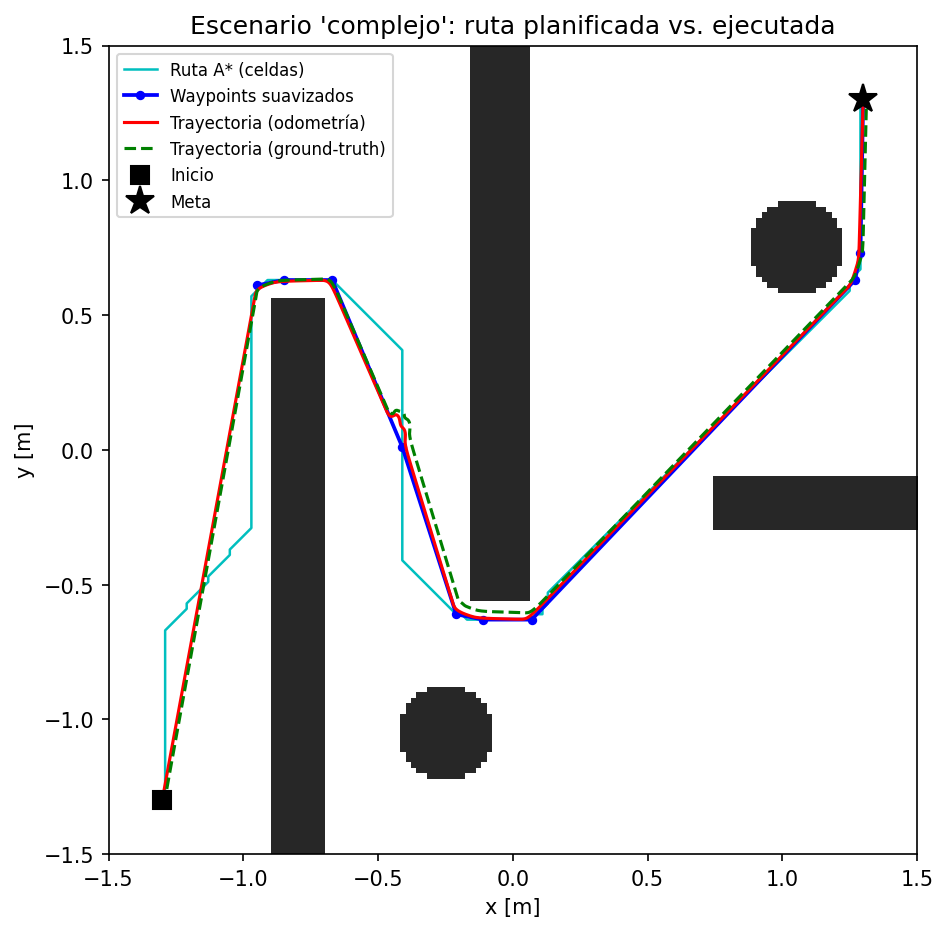

# Navegación Autónoma con Planificación de Rutas (A\*) en e-puck (Webots)

**Proyecto Final · ICI 4150, Robótica y Sistemas Autónomos 2026, PUCV**

### Integrantes

- Esteban Schanze, esteban.schanze.c@mail.pucv.cl
- Eva Ponce, eva.ponce@pucv.cl
- Nicolás Fuentes, nicolas.fuentes@pucv.cl
- Juan Geraldo, juan.geraldo@pucv.cl

***

## 1. Tipo de Robot y Configuración en Webots

### Robot utilizado

Para este proyecto ocupamos el e-puck estándar que viene en Webots (PROTO `E-puck`). Es un robot móvil con tracción diferencial, es decir, tiene dos ruedas motrices independientes, y le habilitamos el modo cinemático (`kinematic = TRUE`). Calibramos sus parámetros físicos en el archivo `config.py` comparándolos con el GPS y la brújula como referencia real, ya que los valores por defecto del PROTO (0.0205 m y 0.052 m) hacían que la odometría calculara mal las rotaciones:

| Parámetro | Valor | Nota |
|---|---|---|
| Radio de la rueda (`RADIO_RUEDA`) | 0.019967 m | Ajustado empíricamente (nominal: 0.0205) |
| Distancia entre ejes (`DIST_ENTRE_RUEDAS`) | 0.0656 m | Ajustado empíricamente (nominal: 0.052) |
| Radio del cuerpo (`RADIO_ROBOT`) | 0.035 m | Valor por defecto |
| Velocidad angular máxima por rueda (`VEL_MAX_MOTOR`) | ±6.28 rad/s | Límite del motor |
| Velocidad lineal máxima (`V_MAX`) | 0.08 m/s | Límite de avance |

### Configuración del entorno

Diseñamos dos escenarios usando una `RectangleArena` de 3 m × 3 m centrada en el origen, con límites de ±1.5 m en los ejes X e Y. La pista está en el plano X–Y y el eje Z apunta hacia arriba (la típica convención ENU de Webots). Para correr esto se necesita Webots R2023b o superior.

Generamos dos mundos con el script `worlds/generar_mundos.py`:

| Mundo | Obstáculos | Inicio | Meta |
|---|---|---|---|
| `worlds/simple.wbt` | 1 barrera rectangular (0.24 × 1.80 m) y 1 cilindro (r = 0.18 m) | (−1.25, −1.25) | (1.25, 1.25) |
| `worlds/complejo.wbt` | 3 muros formando pasillos en S, 2 cilindros (r = 0.16 m) y 1 caja no mapeada | (−1.30, −1.30) | (1.30, 1.30) |

Las posiciones de inicio, meta y los obstáculos se definen en `config.py` (en los diccionarios `ESCENARIOS`). Ojo que en el escenario complejo pusimos a propósito un `PlasticCrate` (0.20 × 0.20 m) directo en el `.wbt` sin declararlo en la configuración. Esto nos sirvió para poner a prueba la reacción del robot y ver si lograba replanificar su ruta al toparse con algo inesperado.

Además, le pusimos un `GPS` y un `Compass` al robot para tener datos de referencia. Si sacas estos sensores, el robot va a seguir navegando usando pura odometría y avisará por consola, solo que no se calcularán las métricas de error.

***

## 2. Sistema de Sensores e Instrumentación

### Sensores incorporados

| Sensor | Dispositivo en Webots | Cantidad | Rango / Tipo |
|---|---|---|---|
| Sensores de proximidad IR | `ps0` a `ps7` | 8 | Valores de 0 a 4096 (no lineal, mayor valor es más cerca) |
| Encoders | `left wheel sensor`, `right wheel sensor` | 2 | Posición angular acumulada en radianes |
| GPS | `gps` | 1 (opcional) | Posición real (x, y, z) |
| Brújula (Compass) | `compass` | 1 (opcional) | Ángulo real (se calcula con `atan2(c_x, c_y)`) |

### Procesamiento de las lecturas

**Sensores infrarrojos (proximidad):**

- **Frecuencia de muestreo:** Se consultan en cada paso de simulación.
- **Suavizado:** Cada uno de los 8 sensores pasa por un filtro de media móvil exponencial (EMA) con un factor de `α = 0.35` (`filtro.py`). Esto ayuda a limpiar bastante el ruido sin perder velocidad de reacción.
- **Conversión a distancia:** Mapeamos los valores crudos a metros usando una tabla de 10 puntos de calibración (`TABLA_IR` en `config.py`). Va desde 4095 (contacto) hasta 67 (unos 7 cm) usando interpolación lineal (`np.interp`). Esto alimenta luego al filtro de Kalman.
- **Uso:** Los sensores frontales (`ps0`, `ps1`, `ps6`, `ps7`) son los que gatillan la evasión de emergencia. Los laterales ayudan a decidir hacia dónde conviene girar.

**Encoders de las ruedas:**

- Se leen constantemente para ver cuánto avanzó cada rueda (`Δθ_l` y `Δθ_r`).
- El script `odometria.py` toma estos valores y calcula la nueva posición `(x, y, φ)` asumiendo un movimiento circular:

$$x_k = x_{k-1} + \Delta s \cdot \cos\!\left(\varphi_{k-1} + \frac{\Delta\varphi}{2}\right), \quad y_k = y_{k-1} + \Delta s \cdot \sin\!\left(\varphi_{k-1} + \frac{\Delta\varphi}{2}\right)$$

- También guardamos el último avance lineal para que el filtro de Kalman pueda hacer su predicción.

**Filtro de Kalman 1D (`filtro.py`):**

- **Estado:** Estima a qué distancia está el obstáculo frontal más cercano.
- **Predicción:** Usamos la odometría para restar la distancia que ya avanzamos, con un ruido de proceso bajito (`Q = 1×10⁻⁵`).
- **Corrección:** Usamos la distancia medida por los sensores infrarrojos con su respectivo ruido (`R = 4×10⁻⁴`). 
- **Cuándo se activa:** Solo cuando los sensores detectan algo claro, superando un umbral base (`IR_PISO_RUIDO = 80.0`).
- **Propósito:** Fusiona la lectura de los motores con los sensores de proximidad para tener un cálculo mucho más estable de la distancia frontal, clave para esquivar y replanificar.

**GPS y Brújula (opcionales):**

- Los usamos solo para registrar qué tan bien lo hace la odometría comparando con la posición real. Nunca se usan para corregir el rumbo del robot (`USAR_GT_PARA_CONTROL = False`). Si los borras del escenario, el robot sigue funcionando sin problemas.

***

## 3. Arquitectura del Controlador Implementado

### Diseño híbrido

Armamos un controlador que mezcla dos enfoques mediante una máquina de estados con histéresis:

1. **Capa deliberativa:** Piensa a futuro. Crea una grilla, infla los obstáculos y usa A\* para armar una ruta suave punto por punto.
2. **Capa reactiva:** Reacciona en el momento. Frena o esquiva usando los infrarrojos si aparece algo repentino, muy al estilo Braitenberg.

### Máquina de estados

El cerebro del robot se mueve entre estos cinco modos:

| Estado | ¿Qué hace? |
|---|---|
| `PLAN` | Arma la grilla, calcula A\* y suaviza el camino |
| `FOLLOW_PATH` | Persigue los puntos de la ruta usando control proporcional |
| `AVOID` | Se activa la evasión de emergencia |
| `GOAL_REACHED` | Llegó a la meta y apaga los motores |
| `SIN_RUTA` | El algoritmo no encontró salida y se rinde |

Para cambiar de estado usamos histéresis. Por ejemplo, entra a evasión cuando el sensor marca 140, pero no sale de ahí hasta que baja de 90. Esto evita que el robot se quede "titubeando" si la lectura del sensor oscila justo en el límite.

### Flujo del ciclo de control

En cada "paso" de simulación, el script `epuck_navegacion.py` hace lo siguiente:

```text
1. LEER       -> Sensores, encoders y posición real.
2. ESTIMAR    -> Actualiza la odometría y pasa los filtros (EMA y Kalman).
3. PERCIBIR   -> Revisa si hay riesgo inminente de chocar (capa reactiva).
4. DECIDIR    -> Ve si necesita cambiar de estado (ej: de seguir ruta a esquivar). 
                 Si lleva mucho rato estancado, replanifica.
5. ACTUAR     -> Calcula las velocidades según el estado actual.
6. CONVERTIR  -> Transforma el comando general a velocidades individuales para cada rueda.
7. REGISTRAR  -> Guarda todos los datos en un archivo CSV para analizarlos después.
```

### Archivos principales

| Archivo | ¿De qué se encarga? |
|---|---|
| `epuck_navegacion.py` | Es el orquestador principal del proyecto y maneja el bucle de Webots. |
| `grilla.py` | Arma el mapa cuadriculado y "engorda" los obstáculos. |
| `planificador.py` | Ejecuta el algoritmo A\* para encontrar la salida. |
| `controlador.py` | Acelera y dobla para perseguir la ruta trazada. |
| `odometria.py` | Intenta adivinar dónde está el robot sumando los giros de las ruedas. |
| `filtro.py` | Limpia los datos de los sensores para que no sean tan ruidosos. |
| `reactivo.py` | Esquiva paredes si algo sale mal. |
| `registro.py` | Guarda las métricas en un Excel o CSV. |

***

## 4. Estrategia de Navegación

### Planificación con A\* sobre grilla

Nuestro enfoque principal es generar un mapa antes de arrancar usando los datos de `config.py` y resolverlo con A\*. La reacción rápida funciona solo como un seguro de vida por si algo se cruza en el camino.

### Detalles de la implementación

1. **Mapa de celdas:** Tomamos la pista de 3×3 metros y la picamos en cuadritos de 2 cm, armando una matriz de 150×150. Dibujamos los obstáculos marcando las celdas ocupadas. Luego, "inflamos" estos bordes sumando el radio del robot más un margen de seguridad (5 cm en total). Esto nos facilita la vida porque ahora podemos considerar al robot como si fuera un simple punto.

2. **Algoritmo A\*:** Usamos una variante con conectividad de 8 direcciones (ortogonales y diagonales). Le pusimos una regla estricta para evitar que corte esquinas demasiado cerradas que harían chocar al robot. Si la posición inicial o la meta caen dentro de un obstáculo inflado, el sistema busca la celda libre más cercana automáticamente.

3. **Suavizado de la ruta:** A\* entrega un camino muy pixelado y en zig-zag. Para arreglarlo, pasamos una función que une puntos lejanos con líneas rectas (siempre y cuando no crucen un obstáculo). Esto simplifica el recorrido drásticamente, en el escenario simple pasamos de un montón de celdas a solo 4 puntos clave.

4. **El parche reactivo:** Como el mapa es estático, la única forma de lidiar con una caja sorpresa es con la capa reactiva. Si el robot pasa más de 150 turnos seguidos tratando de esquivar algo, asume que el camino está bloqueado. En ese momento, toma la posición estimada del obstáculo usando el filtro de Kalman, la dibuja en la matriz, y vuelve a correr A\* desde cero.

***

## 5. Control de Movimiento y Gestión del Entorno

### 5.1 Seguimiento con control proporcional

Para movernos hacia un punto destino `(wx, wy)`, calculamos el error de ángulo y ajustamos las velocidades:

$$e_{ang} = \text{normalizar}\!\left(\arctan2(w_y - y,\; w_x - x) - \varphi\right)$$

$$\omega = \text{clamp}\!\left(K_{p,ang} \cdot e_{ang},\; \pm W_{MAX}\right)$$

$$v = \min(K_{p,lin} \cdot d,\; V_{MAX}) \cdot \max(0,\; \cos e_{ang})$$

Aquí implementamos la lógica de "gira primero, avanza después". Si el error es mayor a 90 grados, el robot frena en seco y gira sobre su propio eje. Una vez que está alineado, empieza a acelerar hacia adelante. Consideramos que llegó al punto cuando está a menos de 5 cm.

### 5.2 Esquivar obstáculos al estilo Braitenberg

Si los sensores IR frontales saltan sobre `140`, pasamos a modo evasivo:

- **Peligro extremo** (señal > 1000): Frena linealmente por completo y solo gira para salvarse del choque.
- **Peligro normal**: Avanza súper lento (0.02 m/s).
- **Hacia dónde girar**: Compara los sensores izquierdos contra los derechos. Gira hacia donde la señal sea más baja, es decir, el lado más despejado.

### 5.3 Re-planificar cuando se queda atrapado

Si el e-puck se queda pegado más de 150 ciclos intentando esquivar algo, hace lo siguiente:

1. Calcula a qué distancia está ese obstáculo no invitado usando su filtro frontal.
2. Le pinta un círculo de radio 5 cm a la matriz justo enfrente suyo.
3. Vuelve a inflar el mapa y le pide a A\* que le calcule una nueva ruta hacia la meta.
4. Si la encuentra, sigue viaje. Si no, se da por vencido y se apaga.

### 5.4 Mapeo dinámico

No armamos un mapa desde cero con los sensores (eso sería SLAM total). Arrancamos con un mapa predefinido y la única modificación en vivo es cuando agregamos una mancha circular si chocamos con algo inesperado.

***

## 6. Evaluación de Resultados en Escenarios de Prueba

Creamos un script `analisis/analizar.py` que lee los datos generados durante la corrida y saca las métricas. Esto fue lo que nos dio.

### Escenario `simple`

| Métrica | Valor |
|---|---|
| Tiempo en llegar | 49.63 s |
| Distancia planificada | 3.969 m |
| Distancia real recorrida | 3.940 m |
| Desviación de la ruta (promedio / máx) | 6 mm / 12 mm |
| Riesgos de colisión | 0 |
| Desviación odométrica (promedio / máx) | 6 mm / 10 mm |
| Error de ángulo medio | 0.08° |
| Resultado | ✅ Éxito rotundo |

En la pista fácil, el e-puck se movió súper fluido. De hecho, hizo un recorrido más corto que el planificado y el error máximo de odometría fue de menos de un centímetro. Como los obstáculos estaban bien separados, ni siquiera tuvo que activar la corrección de Kalman.

### Escenario `complejo`

| Métrica | Valor |
|---|---|
| Tiempo en llegar | 80.42 s |
| Distancia planificada | 6.242 m |
| Distancia real recorrida | 6.213 m |
| Desviación de la ruta (promedio / máx) | 13 mm / 60 mm |
| Riesgos de colisión | 4 |
| Desviación odométrica (promedio / máx) | 19 mm / 42 mm |
| Error de ángulo medio | 0.10° |
| Filtrado IR (crudo vs Kalman) | 100.89 vs 0.019 (varianza) |
| Resultado | ✅ Éxito |

Acá lo pusimos a prueba con pasillos estrechos y una caja sorpresa. Demoró más, por supuesto, y rozó un par de veces las paredes (4 casi-colisiones), pero sobrevivió. El filtro de Kalman hizo la pega maravillosamente aquí, bajando el ruido de los sensores en pasillos a una fracción diminuta. La caja sorpresa fue superada gracias a que la capa reactiva la rodeó con éxito.

***

## 7. Análisis de Gráficos de Rendimiento

### Mapa de navegación: Escenario Simple


*La figura muestra la grilla de ocupación generada, la ruta inicial planificada mediante A\* y la trayectoria final suavizada y ejecutada por el e-puck, evidenciando un recorrido directo hacia la meta.*

### Mapa de navegación: Escenario Complejo



*La figura ilustra el desempeño del robot en un entorno con pasillos estrechos. Se observa cómo el sistema ajusta los giros para navegar con éxito y rodear los obstáculos.*

### Otras figuras generadas

Los siguientes gráficos se generan para registrar el comportamiento interno del sistema:

- **`errores_simple.png` y `errores_complejo.png`**: Grafican la evolución temporal de la distancia a la ruta planificada, el error de posición de la odometría respecto al ground-truth y el error de orientación acumulado.
- **`senales_simple.png` y `senales_complejo.png`**: Presentan la señal de proximidad del sensor infrarrojo frontal (cruda vs filtrada por EMA) en conjunto con la estimación de distancia calculada por el filtro de Kalman.

***

## 8. Limitaciones, Desafíos y Futuras Mejoras

### Puntos débiles detectados

1. **Dependemos de un mapa previo:** Como no mapeamos sobre la marcha usando log-odds o SLAM, somos algo ciegos a cambios grandes en el entorno. Si aparece algo enorme, el robot demora unos 5 segundos (150 ciclos) en darse por enterado de que la ruta está mala y debe replanificar.
2. **Odometría a ciegas:** Calibramos bien las ruedas, pero a la larga, la odometría siempre se desvía. Si hiciéramos un circuito de 20 metros, probablemente acumularía un error grande al llegar a la meta.
3. **Sensores limitados:** Los infrarrojos solo miden hasta 7 centímetros. Además, el robot tiene puntos ciegos en las esquinas traseras, así que dar marcha atrás es un peligro.

### ¿Qué le agregaríamos a futuro?

1. **Filtro de Kalman Extendido (EKF):** Para no depender solo de la odometría, sumaríamos un filtro que tome datos de las ruedas, giroscopio y un GPS simulado para tener la posición perfecta todo el tiempo.
2. **Mapeo en tiempo real:** Usar un enfoque SLAM simple para ir pintando y borrando obstáculos de la matriz a medida que los vamos descubriendo con los sensores.
3. **Algoritmos más modernos:** Cambiar A\* por Theta\*, que encuentra diagonales de forma más natural sin necesitar un paso extra de suavizado, y mover el robot usando Pure Pursuit en vez de nuestro control actual. Así las curvas se verían mucho más elegantes en lugar de que el robot tenga que frenar en seco para rotar.

***

## 9. Conclusión General

Logramos armar un sistema de navegación bastante sólido que combina lo mejor de dos mundos: la capacidad de armar una ruta inteligente de antemano y los reflejos para no chocar si las cosas salen mal. 

El e-puck resolvió el laberinto fácil en 49 segundos y el complejo en poco más de un minuto, arreglándoselas incluso cuando le tiramos un obstáculo sorpresa al medio del camino. La calibración manual de las ruedas valió la pena, logrando un error de posicionamiento final menor a 5 cm después de dar un montón de curvas. 

Finalmente, este proyecto conecta todo lo que venimos viendo: tomamos la odometría básica y la lectura de sensores, pero le dimos al robot "el cerebro" (el mapa cuadriculado y A\*) para que sepa exactamente a dónde ir en vez de simplemente vagar sin rumbo. Ninguna de las capas por sí sola habría podido resolver el laberinto completo, pero juntas logramos la meta de forma exitosa.
